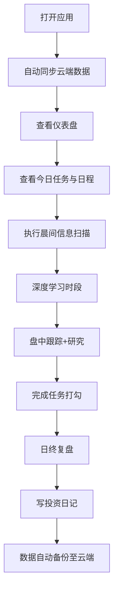
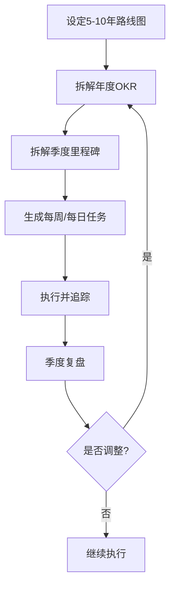
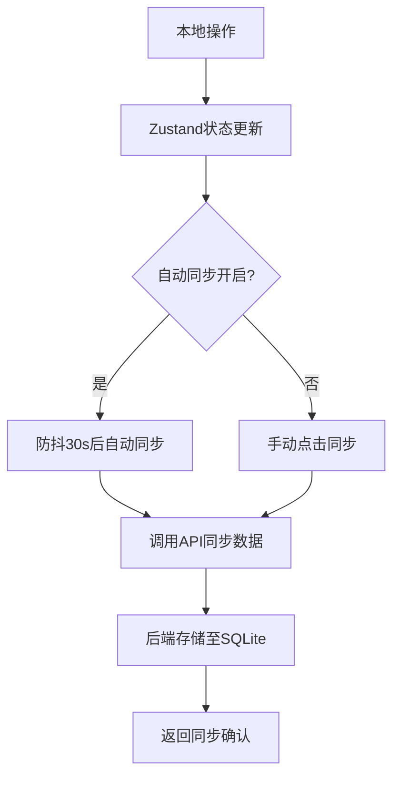

# AlphaPath — 基金经理成长管理系统 PRD

## 1. 产品概述

AlphaPath 是一款面向二级市场投资从业者的个人成长管理系统，帮助用户从行业分析师成长为全产业覆盖的基金经理。系统整合目标规划、日程管理、任务追踪、学习记录、技能评估与投资日记于一体，覆盖 A 股/港股/美股三市场研究场景，支撑用户实现年化 20%+ 的长期投资目标。

- 目标用户：有志成为全产业覆盖基金经理的二级市场研究员/分析师
- 核心价值：将模糊的职业成长路径转化为可量化、可追踪、可迭代的系统化行动
- 数据安全：所有数据云端备份，支持多设备同步，支持版本迭代与数据导出

## 2. 核心功能

### 2.1 用户角色

| 角色 | 注册方式 | 核心权限 |
|------|----------|----------|
| 个人用户 | 邮箱+密码注册 | 全部功能，数据云端存储与备份 |

### 2.2 功能模块

1. **仪表盘**：全局概览，今日任务、进度指标、市场日历、技能雷达
2. **目标路线图**：5-10 年分阶段规划，年度 OKR，里程碑追踪
3. **日程管理**：工作日/周末差异化日程模板，时间块管理
4. **任务中心**：四象限分类，8 大标签体系，每日/每周/每月/每季度必做清单
5. **学习追踪**：书籍/课程/论文阅读记录，学习进度可视化
6. **投资日记**：每日复盘记录，决策逻辑与结果追踪
7. **技能雷达**：5 维技能自评，季度更新，成长曲线
8. **策略框架**：牛市/熊市/震荡市策略管理，信号清单
9. **数据管理**：云端备份、数据导出、版本历史、跨设备同步

### 2.3 页面详情

| 页面名称 | 模块名称 | 功能描述 |
|----------|----------|----------|
| 登录/注册 | 认证表单 | 邮箱+密码注册登录，JWT 鉴权 |
| 仪表盘 | 今日概览 | 显示今日待办、已完成任务数、连续打卡天数 |
| 仪表盘 | 市场日历 | 显示本周重要经济数据发布、财报季、政策会议 |
| 仪表盘 | 技能雷达图 | 5 维雷达图（产业/个股/宏观/策略/量化） |
| 仪表盘 | 进度指标 | 年度 OKR 完成度、当前阶段进度条 |
| 仪表盘 | 快捷入口 | 新建任务、写投资日记、记录学习 |
| 仪表盘 | 同步状态 | 显示云端同步状态、最后同步时间 |
| 目标路线图 | 阶段时间线 | 4 个阶段（夯实/拓展/整合/基金经理）的可视化时间线 |
| 目标路线图 | 年度 OKR | 每年的 Objectives 和 Key Results，进度条追踪 |
| 目标路线图 | 里程碑 | 关键里程碑节点，完成状态标记 |
| 日程管理 | 日程模板 | 工作日/周末两种模板，时间块展示 |
| 日程管理 | 今日日程 | 基于模板生成的今日安排，可调整 |
| 日程管理 | 周计划 | 本周重点任务排期 |
| 任务中心 | 任务列表 | 按四象限/标签/日期筛选的任务列表 |
| 任务中心 | 新建任务 | 创建任务（标题、描述、标签、优先级、截止日期） |
| 任务中心 | 必做清单 | 每日/每周/每月/每季度必做清单模板 |
| 任务中心 | 完成记录 | 已完成任务的历史记录，支持统计 |
| 学习追踪 | 学习列表 | 书籍/课程/论文列表，进度百分比 |
| 学习追踪 | 学习统计 | 本月学习时长、完成数量、分类占比 |
| 学习追踪 | 添加学习 | 记录新的学习内容（类型、标题、进度、笔记） |
| 投资日记 | 日记列表 | 按日期排列的投资日记 |
| 投资日记 | 写日记 | 市场观点、交易记录、决策逻辑、反思 |
| 投资日记 | 月度复盘 | 按月汇总的复盘报告 |
| 技能雷达 | 雷达图 | 交互式 5 维雷达图，历史对比 |
| 技能雷达 | 评分记录 | 每次自评的详细记录 |
| 技能雷达 | 成长曲线 | 各技能维度的时间序列变化 |
| 策略框架 | 策略卡片 | 牛市/熊市/震荡市三种策略卡片 |
| 策略框架 | 信号清单 | 市场信号检查清单，标记当前状态 |
| 策略框架 | 历史回测 | 记录策略在历史场景中的表现 |
| 设置 | 数据管理 | 云端备份开关、手动同步、导出数据（JSON） |
| 设置 | 版本历史 | 数据变更历史记录，支持回滚 |
| 设置 | 账户管理 | 修改密码、退出登录 |

## 3. 核心流程

### 3.1 每日使用流程

用户每日打开应用 → 自动同步云端数据 → 查看仪表盘今日概览 → 按日程模板执行 → 完成任务打勾 → 晨间/日终写投资日记 → 数据自动备份至云端

### 3.2 目标管理流程

设定 5-10 年路线图 → 拆解年度 OKR → 拆解季度里程碑 → 生成每周/每日任务 → 执行并追踪 → 季度复盘调整

### 3.3 数据同步流程

本地操作 → Zustand 状态更新 → 自动/手动触发 API 同步 → 后端存储至 SQLite → 返回同步确认

## 4. 用户界面设计

### 4.1 设计风格

- **主色调**：深色系为主（#0F1419 深墨色背景），搭配金色（#D4A853）作为强调色，传达专业、沉稳、高端的投资人气质
- **辅助色**：翡翠绿（#10B981，正向/完成）、琥珀橙（#F59E0B，警告/待办）、珊瑚红（#EF4444，紧急/亏损）
- **字体**：标题使用 Playfair Display（衬线体，传达经典与权威），正文使用 DM Sans（现代无衬线，清晰易读）
- **布局**：左侧导航栏 + 右侧内容区，卡片式布局，大量留白
- **按钮风格**：圆角矩形（8px），微妙的渐变和阴影，hover 时有光泽感
- **图标风格**：线性图标（Lucide），1.5px 描边
- **整体气质**：Bloomberg Terminal 的专业感 + Notion 的简洁感，金融终端风格

### 4.2 页面设计概览

| 页面名称 | 模块名称 | UI 元素 |
|----------|----------|---------|
| 登录/注册 | 认证表单 | 居中卡片表单，金色 Logo，深色背景 |
| 仪表盘 | 今日概览 | 深色卡片，金色数字高亮，进度环 |
| 仪表盘 | 技能雷达 | SVG 雷达图，金色填充，深色背景 |
| 仪表盘 | 市场日历 | 时间轴样式，事件标签带颜色编码 |
| 仪表盘 | 快捷入口 | 圆角按钮组，图标+文字 |
| 仪表盘 | 同步状态 | 小图标+文字，绿色=已同步，橙色=待同步 |
| 目标路线图 | 阶段时间线 | 垂直时间线，节点带图标，金色连线 |
| 目标路线图 | 年度 OKR | 卡片式，进度条，KR 打勾列表 |
| 日程管理 | 时间块 | 垂直时间轴，彩色时间块 |
| 任务中心 | 任务列表 | 四象限布局或列表视图切换，标签色块 |
| 任务中心 | 新建任务 | 模态框表单，标签选择器 |
| 学习追踪 | 学习列表 | 书脊样式卡片，进度条 |
| 投资日记 | 日记编辑 | 文本编辑器，深色背景 |
| 技能雷达 | 雷达图 | 交互式 SVG，hover 显示分数 |
| 策略框架 | 策略卡片 | 三列卡片（牛/熊/震荡），图标+要点 |
| 设置 | 数据管理 | 开关、按钮、同步状态指示器 |

### 4.3 响应式设计

- 桌面端（≥1024px）：左侧固定导航 + 右侧内容区，多列布局
- 平板端（768-1023px）：可折叠侧边栏，双列布局
- 移动端（<768px）：底部 Tab 导航，单列布局，卡片全宽

### 4.4 动效设计

- 页面切换：淡入淡出 + 微微上移
- 卡片 hover：轻微上浮 + 阴影加深
- 进度条：加载时从左到右动画填充
- 雷达图：数据更新时平滑过渡
- 任务完成：打勾动画 + 数字跳动
- 侧边栏：展开/收起滑动动画
- 同步指示：旋转图标 + 状态文字切换
