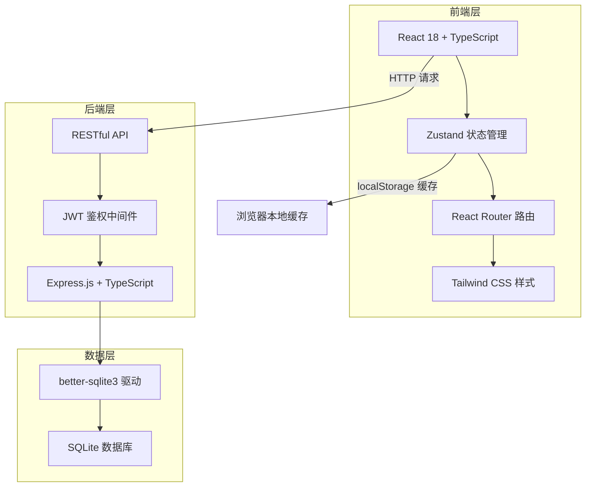
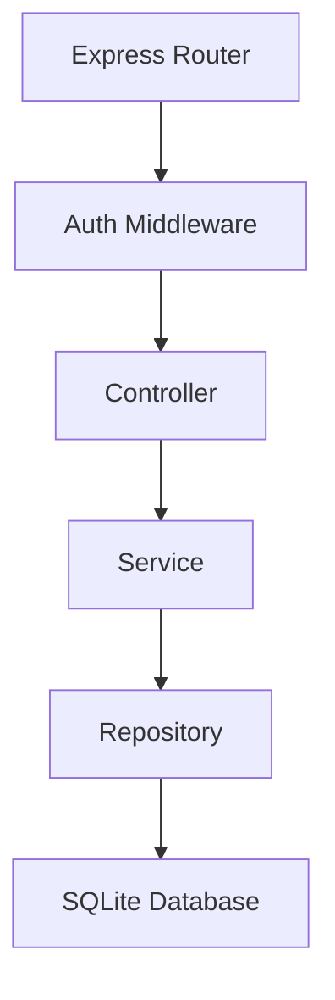

# AlphaPath — 技术架构文档

## 1. 架构设计

前后端分离架构，前端 React + 后端 Express，数据存储在 SQLite，支持云端备份与多设备同步。



## 2. 技术说明

- **前端框架**：React 18 + TypeScript
- **构建工具**：Vite
- **样式方案**：Tailwind CSS 3
- **状态管理**：Zustand（含 persist middleware 本地缓存 + API 同步）
- **路由**：React Router DOM v6
- **图标库**：Lucide React
- **图表**：自绘 SVG（雷达图、进度环）+ CSS 动画
- **后端框架**：Express 4 + TypeScript（ESM）
- **数据库**：SQLite（better-sqlite3）
- **鉴权**：JWT（jsonwebtoken）
- **密码加密**：bcryptjs

## 3. 路由定义

### 3.1 前端路由

| 路由 | 用途 |
|------|------|
| `/login` | 登录页面 |
| `/register` | 注册页面 |
| `/` | 仪表盘 - 全局概览 |
| `/roadmap` | 目标路线图 - 5-10 年规划 |
| `/schedule` | 日程管理 - 每日时间安排 |
| `/tasks` | 任务中心 - 任务管理 |
| `/learning` | 学习追踪 - 学习记录 |
| `/journal` | 投资日记 - 复盘记录 |
| `/skills` | 技能雷达 - 技能评估 |
| `/strategy` | 策略框架 - 投资策略 |
| `/settings` | 设置 - 数据管理与账户 |

### 3.2 后端 API

| 方法 | 路径 | 用途 |
|------|------|------|
| POST | `/api/auth/register` | 用户注册 |
| POST | `/api/auth/login` | 用户登录 |
| GET | `/api/auth/me` | 获取当前用户信息 |
| GET | `/api/goals` | 获取所有目标 |
| POST | `/api/goals` | 创建目标 |
| PUT | `/api/goals/:id` | 更新目标 |
| DELETE | `/api/goals/:id` | 删除目标 |
| GET | `/api/okrs` | 获取所有 OKR |
| POST | `/api/okrs` | 创建 OKR |
| PUT | `/api/okrs/:id` | 更新 OKR |
| GET | `/api/tasks` | 获取所有任务 |
| POST | `/api/tasks` | 创建任务 |
| PUT | `/api/tasks/:id` | 更新任务 |
| DELETE | `/api/tasks/:id` | 删除任务 |
| GET | `/api/learnings` | 获取所有学习记录 |
| POST | `/api/learnings` | 创建学习记录 |
| PUT | `/api/learnings/:id` | 更新学习记录 |
| DELETE | `/api/learnings/:id` | 删除学习记录 |
| GET | `/api/journals` | 获取所有投资日记 |
| POST | `/api/journals` | 创建投资日记 |
| PUT | `/api/journals/:id` | 更新投资日记 |
| DELETE | `/api/journals/:id` | 删除投资日记 |
| GET | `/api/skills` | 获取技能评估记录 |
| POST | `/api/skills` | 创建技能评估 |
| GET | `/api/strategies` | 获取策略框架 |
| PUT | `/api/strategies/:id` | 更新策略框架 |
| POST | `/api/sync` | 全量数据同步（上传本地变更） |
| GET | `/api/sync` | 全量数据同步（下载云端数据） |
| GET | `/api/export` | 导出所有数据为 JSON |
| GET | `/api/versions` | 获取版本历史 |
| POST | `/api/versions/:id/restore` | 回滚到指定版本 |

## 4. API 数据结构

### 4.1 通用响应格式

```typescript
interface ApiResponse<T> {
  success: boolean;
  data?: T;
  error?: string;
}

interface PaginatedResponse<T> {
  success: boolean;
  data: T[];
  total: number;
}
```

### 4.2 认证相关

```typescript
interface RegisterRequest {
  email: string;
  password: string;
  name: string;
}

interface LoginRequest {
  email: string;
  password: string;
}

interface AuthResponse {
  token: string;
  user: {
    id: string;
    email: string;
    name: string;
  };
}
```

### 4.3 业务数据结构

```typescript
interface Goal {
  id: string;
  userId: string;
  title: string;
  phase: string;
  startYear: number;
  endYear: number;
  description: string;
  milestones: Milestone[];
  okrs: OKR[];
  createdAt: string;
  updatedAt: string;
}

interface Milestone {
  id: string;
  goalId: string;
  title: string;
  completed: boolean;
  dueDate: string;
}

interface OKR {
  id: string;
  goalId: string;
  year: number;
  objective: string;
  keyResults: KeyResult[];
}

interface KeyResult {
  id: string;
  okrId: string;
  description: string;
  progress: number;
  completed: boolean;
}

interface Task {
  id: string;
  userId: string;
  title: string;
  description: string;
  quadrant: 'A' | 'B' | 'C' | 'D';
  tags: string[];
  dueDate: string;
  completed: boolean;
  completedAt: string | null;
  createdAt: string;
  updatedAt: string;
  recurrence: 'none' | 'daily' | 'weekly' | 'monthly' | 'quarterly';
}

interface Learning {
  id: string;
  userId: string;
  title: string;
  type: 'book' | 'course' | 'paper' | 'report';
  progress: number;
  notes: string;
  startDate: string;
  completedDate: string | null;
  createdAt: string;
  updatedAt: string;
}

interface Journal {
  id: string;
  userId: string;
  date: string;
  marketView: string;
  decisions: string;
  reflections: string;
  mood: 'bullish' | 'neutral' | 'bearish';
  createdAt: string;
  updatedAt: string;
}

interface SkillAssessment {
  id: string;
  userId: string;
  date: string;
  notes: string;
  scores: {
    industry: number;
    stock: number;
    macro: number;
    strategy: number;
    quant: number;
  };
  createdAt: string;
}

interface Strategy {
  id: string;
  userId: string;
  type: 'bull' | 'bear' | 'range';
  positionGuidance: string;
  allocationGuidance: string;
  stockSelection: string;
  signals: string;
  hedging: string;
  updatedAt: string;
}
```

## 5. 服务器架构



## 6. 数据模型

### 6.1 数据库表结构

```sql
-- 用户表
CREATE TABLE users (
  id TEXT PRIMARY KEY,
  email TEXT UNIQUE NOT NULL,
  password TEXT NOT NULL,
  name TEXT NOT NULL,
  created_at TEXT DEFAULT (datetime('now')),
  updated_at TEXT DEFAULT (datetime('now'))
);

-- 目标表
CREATE TABLE goals (
  id TEXT PRIMARY KEY,
  user_id TEXT NOT NULL REFERENCES users(id),
  title TEXT NOT NULL,
  phase TEXT NOT NULL,
  start_year INTEGER NOT NULL,
  end_year INTEGER NOT NULL,
  description TEXT,
  created_at TEXT DEFAULT (datetime('now')),
  updated_at TEXT DEFAULT (datetime('now'))
);

-- 里程碑表
CREATE TABLE milestones (
  id TEXT PRIMARY KEY,
  goal_id TEXT NOT NULL REFERENCES goals(id) ON DELETE CASCADE,
  title TEXT NOT NULL,
  completed INTEGER DEFAULT 0,
  due_date TEXT,
  sort_order INTEGER DEFAULT 0
);

-- OKR 表
CREATE TABLE okrs (
  id TEXT PRIMARY KEY,
  goal_id TEXT NOT NULL REFERENCES goals(id) ON DELETE CASCADE,
  year INTEGER NOT NULL,
  objective TEXT NOT NULL
);

-- 关键结果表
CREATE TABLE key_results (
  id TEXT PRIMARY KEY,
  okr_id TEXT NOT NULL REFERENCES okrs(id) ON DELETE CASCADE,
  description TEXT NOT NULL,
  progress REAL DEFAULT 0,
  completed INTEGER DEFAULT 0,
  sort_order INTEGER DEFAULT 0
);

-- 任务表
CREATE TABLE tasks (
  id TEXT PRIMARY KEY,
  user_id TEXT NOT NULL REFERENCES users(id),
  title TEXT NOT NULL,
  description TEXT,
  quadrant TEXT DEFAULT 'B',
  tags TEXT DEFAULT '[]',
  due_date TEXT,
  completed INTEGER DEFAULT 0,
  completed_at TEXT,
  recurrence TEXT DEFAULT 'none',
  created_at TEXT DEFAULT (datetime('now')),
  updated_at TEXT DEFAULT (datetime('now'))
);

-- 学习记录表
CREATE TABLE learnings (
  id TEXT PRIMARY KEY,
  user_id TEXT NOT NULL REFERENCES users(id),
  title TEXT NOT NULL,
  type TEXT DEFAULT 'book',
  progress REAL DEFAULT 0,
  notes TEXT,
  start_date TEXT,
  completed_date TEXT,
  created_at TEXT DEFAULT (datetime('now')),
  updated_at TEXT DEFAULT (datetime('now'))
);

-- 投资日记表
CREATE TABLE journals (
  id TEXT PRIMARY KEY,
  user_id TEXT NOT NULL REFERENCES users(id),
  date TEXT NOT NULL,
  market_view TEXT,
  decisions TEXT,
  reflections TEXT,
  mood TEXT DEFAULT 'neutral',
  created_at TEXT DEFAULT (datetime('now')),
  updated_at TEXT DEFAULT (datetime('now'))
);

-- 技能评估表
CREATE TABLE skill_assessments (
  id TEXT PRIMARY KEY,
  user_id TEXT NOT NULL REFERENCES users(id),
  date TEXT NOT NULL,
  notes TEXT,
  industry_score REAL DEFAULT 5,
  stock_score REAL DEFAULT 5,
  macro_score REAL DEFAULT 5,
  strategy_score REAL DEFAULT 5,
  quant_score REAL DEFAULT 5,
  created_at TEXT DEFAULT (datetime('now'))
);

-- 策略框架表
CREATE TABLE strategies (
  id TEXT PRIMARY KEY,
  user_id TEXT NOT NULL REFERENCES users(id),
  type TEXT NOT NULL,
  position_guidance TEXT,
  allocation_guidance TEXT,
  stock_selection TEXT,
  signals TEXT,
  hedging TEXT,
  updated_at TEXT DEFAULT (datetime('now'))
);

-- 数据版本表（用于版本历史和回滚）
CREATE TABLE data_versions (
  id TEXT PRIMARY KEY,
  user_id TEXT NOT NULL REFERENCES users(id),
  snapshot TEXT NOT NULL,
  description TEXT,
  created_at TEXT DEFAULT (datetime('now'))
);

-- 索引
CREATE INDEX idx_tasks_user ON tasks(user_id);
CREATE INDEX idx_tasks_completed ON tasks(completed);
CREATE INDEX idx_learnings_user ON learnings(user_id);
CREATE INDEX idx_journals_user ON journals(user_id);
CREATE INDEX idx_journals_date ON journals(date);
CREATE INDEX idx_skills_user ON skill_assessments(user_id);
CREATE INDEX idx_strategies_user ON strategies(user_id);
CREATE INDEX idx_versions_user ON data_versions(user_id);
```

## 7. 项目结构

```
├── src/                      # 前端代码
│   ├── components/           # 通用组件
│   │   ├── Layout.tsx        # 布局（侧边栏+内容区）
│   │   ├── Sidebar.tsx       # 侧边导航
│   │   ├── MobileNav.tsx     # 移动端底部导航
│   │   ├── RadarChart.tsx    # 雷达图组件
│   │   ├── ProgressRing.tsx  # 进度环组件
│   │   └── TaskItem.tsx      # 任务项组件
│   ├── pages/                # 页面组件
│   │   ├── Login.tsx         # 登录
│   │   ├── Register.tsx      # 注册
│   │   ├── Dashboard.tsx     # 仪表盘
│   │   ├── Roadmap.tsx       # 目标路线图
│   │   ├── Schedule.tsx      # 日程管理
│   │   ├── Tasks.tsx         # 任务中心
│   │   ├── Learning.tsx      # 学习追踪
│   │   ├── Journal.tsx       # 投资日记
│   │   ├── Skills.tsx        # 技能雷达
│   │   ├── Strategy.tsx      # 策略框架
│   │   └── Settings.tsx      # 设置
│   ├── store/                # Zustand 状态管理
│   │   ├── useAuthStore.ts   # 认证状态
│   │   ├── useGoalStore.ts   # 目标/OKR
│   │   ├── useTaskStore.ts   # 任务
│   │   ├── useLearningStore.ts # 学习
│   │   ├── useJournalStore.ts  # 投资日记
│   │   ├── useSkillStore.ts    # 技能
│   │   └── useStrategyStore.ts # 策略
│   ├── api/                  # API 请求封装
│   │   └── client.ts         # axios 实例 + 拦截器
│   ├── data/                 # 初始数据
│   │   └── initialData.ts    # 预设数据
│   ├── utils/                # 工具函数
│   │   └── helpers.ts
│   ├── App.tsx               # 根组件
│   ├── main.tsx              # 入口
│   └── index.css             # 全局样式
├── api/                      # 后端代码
│   ├── src/
│   │   ├── index.ts          # Express 入口
│   │   ├── middleware/
│   │   │   └── auth.ts       # JWT 鉴权中间件
│   │   ├── routes/
│   │   │   ├── auth.ts       # 认证路由
│   │   │   ├── goals.ts      # 目标路由
│   │   │   ├── tasks.ts      # 任务路由
│   │   │   ├── learnings.ts  # 学习路由
│   │   │   ├── journals.ts   # 日记路由
│   │   │   ├── skills.ts     # 技能路由
│   │   │   ├── strategies.ts # 策略路由
│   │   │   └── sync.ts       # 同步/导出路由
│   │   ├── services/
│   │   │   ├── auth.ts
│   │   │   ├── goal.ts
│   │   │   ├── task.ts
│   │   │   ├── learning.ts
│   │   │   ├── journal.ts
│   │   │   ├── skill.ts
│   │   │   ├── strategy.ts
│   │   │   └── sync.ts
│   │   ├── db/
│   │   │   ├── index.ts      # 数据库初始化
│   │   │   └── migrations.ts # 建表与初始数据
│   │   └── utils/
│   │       └── helpers.ts
│   └── tsconfig.json
├── shared/                   # 前后端共享类型
│   └── types.ts
├── migrations/               # 数据库迁移 SQL
├── package.json
├── tsconfig.json
├── vite.config.ts
└── tailwind.config.js
```
